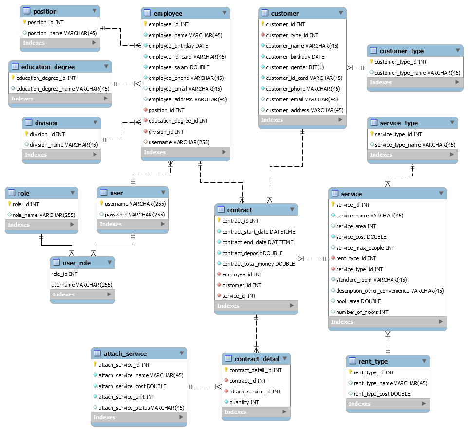
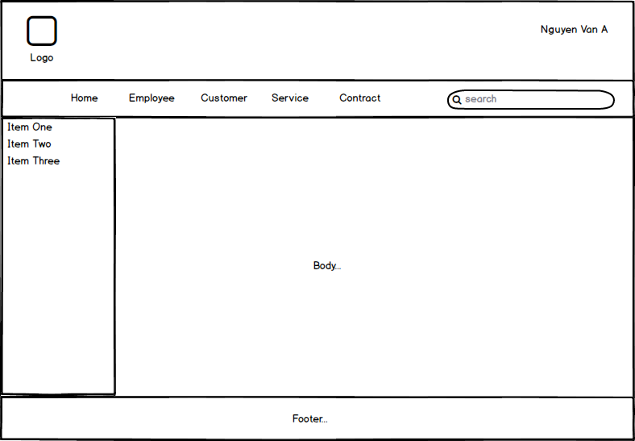
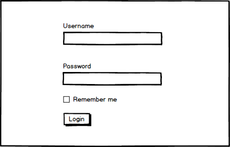

# Ứng Dụng Quản Lý Khu Nghỉ Dưỡng Furama

# Installation instructions
-   Run script cs_m3 in db directory for create schema and data on database
-   Set up Tomcat and run application

# Case study requirements

Học viên sử dụng những kiến thức đã học ở module **JSP & Servlet** để
viết ứng dụng quản lý Customer, Employees và các dịch vụ của khu nghỉ
dưỡng Furama.

# Công nghệ phải dùng

Sau khi kết thúc khóa bài tập, học viên sẽ nắm được các kiến thức sau:

**JSP và Servlet**

  JSTL

  MySQL, JDBC

  Session

# Mô tả hệ thống

Xây dựng hệ thống quản lý khu nghỉ dưỡng Furama tại thành phố Đà Nẵng.
Hệ thống được mô tả như sau:

1. Khu nghỉ dưỡng Furama sẽ cung cấp các dịch vụ cho thuê bao gồm
Villa, House, Room.

Tất cả các dịch vụ này sẽ bao có các thông tin: Tên dịch vụ
(service_name), Diện tích sử dụng (service_area), Chi phí thuê
(service_cost), Số lượng người tối đa (service_max_people), Kiểu thuê
(rent_type_id, bao gồm thuê theo năm, tháng, ngày, giờ).

- Riêng Villa sẽ có thêm thông tin: Tiêu chuẩn phòng (standard_room),
Mô tả tiện nghi khác (description_other_convenience), Diện tích hồ bơi
(pool_area), Số tầng (number_of_floors).

- Riêng House sẽ có thêm thông tin: Tiêu chuẩn phòng (standard_room),
Mô tả tiện nghi khác (description_other_convenience), Số tầng
(number_of_floors).

- Riêng Room sẽ có thêm thông tin: Dịch vụ miễn phí đi kèm.

Ngoài ra, resort còn cung cấp các dịch vụ đi kèm như massage, karaoke,
thức ăn, nước uống, thuê xe di chuyển tham quan resort.

Dịch vụ đi kèm sẽ bao gồm các thông tin: Tên dịch vụ đi kèm
(attach_service_name), Đơn vị (attach_service_unit), Giá tiền
(attach_service_cost)

2. Hệ thống quản lý còn cho phép quản lý thêm thông tin của Employee
resort. Thông tin Employee sẽ bao gồm: Họ tên Employee (employee_name),
Ngày sinh (employee_birthday), Số CMND (employee_id_card), Số ĐT
(employee_phone), Email (employee_email), Trình độ
(education_degree_id), Vị trí (position_id), Lương (employee_salary).

Trình độ sẽ lưu trữ các thông tin (education_degree): Trung cấp, Cao
đẳng, Đại học và sau đại học

Vị trí sẽ lưu trữ các thông tin (position): Lễ tân, phục vụ, chuyên
viên, giám sát, quản lý, giám đốc.

Mỗi Employee sẽ thuộc một bộ phận làm việc (division): Hiện tại resort
bao gồm các bộ phận: Sale -- Marketing, Hành Chính, Phục vụ, Quản lý.

3. Hệ thống cho phép quản lý thêm thông tin của các Customer đến thuê
và sử dụng các dịch vụ của Furama. Thông tin của Customer bao gồm: Họ
tên Customer (customer_name), Ngày sinh (customer_birthday), Giới tính
(customer_gender), Số CMND (customer_id_card), Số Điện Thoại
(customer_phone), Email (customer_email), Loại khách (customer_type_id),
Địa chỉ (customer_address) (resort sẽ phân loại Customer để áp dụng các
chính sách phục vụ cho phù hợp).

Loại Customer bao gồm (customer_type): Diamond, Platinium, Gold, Silver,
Member.

Customer có thể sử dụng các dịch vụ thuê Villa, House, Phòng và các dịch
vụ đi kèm.

Đối với các dịch vụ thuê Villa và House thì Customer cần phải làm hợp
đồng thuê với Furama.

Hợp đồng thuê sẽ bao gồm các thông tin: Số hợp đồng (contract_id), Ngày
bắt đầu (contract_start_date), Ngày kết thúc (contract_end_date), Số
tiền cọc trước (contract_deposit), Tổng số tiền thanh toán
(contract_total_money).

Với lược đồ cơ sở dữ liệu như bên dưới:

IV. #  

V.  # Yêu cầu hệ thống

## Yêu cầu 1 

## **Objectives**

-   *Xây dựng được cấu trúc dư án bằng MVC sử dụng JSP & Servlet*

Tạo project có tên là Module2_AccountName_WBE để thực hiện các yêu cầu
sau:

Khi người dùng gõ địa chỉ trên trình duyệt
[http://localhost:8080](http://localhost:8080) thì hiển
thị ra trang home theo thiết kế dưới đây:

## Yêu cầu 2 

**Objectives**

-   *Kết nối database*

-   *Query như tìm kiếm, thêm mới , xoá , sửa , delete*

Thiết kế các chức năng với yêu cầu sau:

1.  Tạo màn hình thêm mới 1 Khách hàng (sử dụng bảng **customer**)

2.  Tạo màn hình liệt kê danh sách Khách hàng (Dạng bảng, có phân trang,
    > nhảy trang, tìm kiếm, liên kết đến các chức năng xóa và chỉnh sửa
    > thông tin của Khách hàng).

3.  Tạo màn hình thêm mới 1 Dịch vụ (sử dụng bảng **service**)

4.  Tạo màn hình thêm mới 1 Nhân viên (sử dụng bảng **employee**)

5.  Tạo màn hình liệt kê danh sách Nhân viên (Dạng bảng, có phân trang,
    > nhảy trang, tìm kiếm, liên kết đến các chức năng xóa và chỉnh sửa
    > thông tin của Nhân viên).

6.  Tạo màn hình thêm mới 1 Hợp đồng (sử dụng bảng **contract**)

7.  Tạo màn hình thêm mới 1 Hợp đồng chi tiết (sử dụng bảng
    > **contract_detail**)

8.  Tạo màn hình liệt kê danh sách các khách hàng đang sử dụng dịch vụ
    > tại resort (Dạng bảng, có phân trang, nhảy trang, tìm kiếm, liên
    > kết đến các chức năng xóa và chỉnh sửa thông tin của Dịch vụ). Nếu
    > hợp đồng có sử dụng dịch vụ đính kèm thì hãy liệt kê các dịch vụ
    > đính kèm đó ra.\
    > (sử dụng bảng **customer**, **contract, contract_detail,
    > attach_service**)

## Yêu cầu 3 

**Objectives**

-   *Tạo common package để thực hiện validate dữ liệu*

1.  Mã Khách hàng có định dạng là KH-XXXX (X là số từ 0-9)

2.  Mã Dịch vụ có định dạng là DV-XXXX (X là số 0-9)

3.  Số điện thoại phải đúng định dạng 090xxxxxxx hoặc 091xxxxxxx hoặc
    > (84)+90xxxxxxx hoặc (84)+91xxxxxxx

4.  Số CMND phải đúng định dạng XXXXXXXXX hoặc XXXXXXXXXXXX (X là số
    > 0-9)

5.  Địa chỉ email phải đúng định dạng email

6.  Ngày sinh, Ngày làm hợp đồng, Ngày kết thúc sử dụng datepicker để
    > người dùng có thể chọn ngày thuận tiện. Phải validate xem ngày giờ
    > có hợp lệ hay không (đúng định dạng ngày giờ theo format
    > DD/MM/YYYY).

7.  Số lượng, Số tầng phải là số nguyên dương

8.  Lương, Giá, Tiền đặt cọc, Tổng tiền phải là số dương

9.  Tính tổng tiền sử dụng dịch vụ (trong màn hình 9) dựa vào các dữ
    > liệu cố định (là các dữ liệu giả định của học viên, đang để cố
    > định trên trang HTML, không liên quan đến server).

10. Khi click vào nút xóa (hoặc biểu tượng xóa) trên các dòng ở các màn
    > hình liệt kê thì phải hiển thị thông báo confirm việc người dùng
    > có chắc chắn muốn xóa dữ liệu hay không. Nếu người dùng chọn Yes
    > thì xóa dữ liệu ở dòng đó (Ở đây, chúng ta chỉ giả lập thao tác
    > xóa dữ liệu ở phía client, tức là xóa dữ liệu cứng mà học viên
    > đang để cố định trên trang HTML, không liên quan đến dữ liệu phía
    > server).

##  

## Yêu cầu 4 \* *(Học viên tự tìm hiểu)*

**Objectives**

-   *Sử dụng session*

-   *Sử dụng được Cookie*

1.  Tạo màn hình login cho nhân viên, với giao diện mô phỏng như bên
    > dưới:

> 
>
> Sau khi login thành công thì sẽ chuyển hướng sang home. Sử dụng
> Session để lưu họ tên nhân viên sau khi đăng nhập và hiển thị tại góc
> trên bên phải màn hình ở header của tất cả các trang (như giao diện ở
> Yêu cầu 1).

2.  Sử dụng Cookie để lưu tên người dùng (username), password (mật khẩu)
    > khi người dùng chọn checkbox "Remember me", ngược lại thì sẽ không
    > lưu ở Cookie.

##  

## Yêu cầu 5 \* *(Học viên tự tìm hiểu)*

**Objectives**

-   *Sử dụng security với mysql để phân quyền*

> \
> Nếu người dùng là nhân viên "quản lý" hoặc "giám đốc" thì sẽ truy cập
> được vào trang quản lý Nhân viên, được quyền thêm, sửa, xóa Nhân viên.
> Ngược lại, các nhân viên khác thì không có quyền truy cập.
